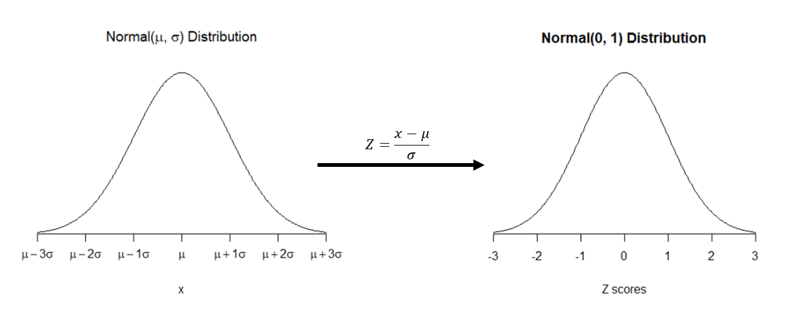

  
```{r setup, include=FALSE}
knitr::opts_chunk$set(echo = TRUE)
source("plotNorm.R")
```

## Learning Objectives

### Statistical Learning Objectives
1. Understand Z scores and percentiles
1. Get experience with the normal distribution

### R Learning Objectives
1. Learn how to use R to work with the normal distribution

### Functions covered in this lab
1. `pnorm()`
1. `qnorm()`

### Weekly Advice
We're going to be working with functions that have multiple arguments. Make sure you put those argument INSIDE the function's parentheses. Otherwise, you'll have trouble `r emo::ji("sad")`
  
## Lab Tutorial
  
This week, we're going to talk about the *normal distribution*. A "distribution" refers to the possible values a random varible can take as well as the probability that it takes those values. It is commonly used to approximate all sorts of things in nature and life.

Let's take a look at the normal distribution. We've written a function for you to make pretty plots of this.

```{r normalPlot}
plotNorm(mean = 0, sd = 1, main = "Standard Normal Distribution, N(0, 1)")
```

*Replace this text with a description of the shape, center, and variability in the above normal distribution.*

It takes two numbers to describe a normal distribution: the **mean** and **standard deviation**. The way we describe a normal distribution is N(mu, sigma), where mu is the population mean and sigma is the population standard deviation. Let's see how these compare:

```{r normalPlots}
par(mfrow = c(1, 3))
plotNorm(mean = 10, sd = 1, main = "N(10, 1)")
plotNorm(mean = 10, sd = 5, main = "N(10, 5)")
plotNorm(mean = 30, sd = 15, main = "N(30, 15)")
par(mfrow = c(1, 1))
```

These plots look the same, but *are they?* Check the axes!

Normal distributions are all bell-shaped, unimodal, and symmetric, regardless of the mean ($\mu$) and standard deviation ($\sigma$). The mean $\mu$ specifies the *center* of the distribution. The standard deviation $\sigma$ specifies the *variability* of the distribution (meaning, how narrow or wide is it?).

Often, it's easier to standardize a normally-distributed random variable by converting it into a "Z score".

### Z Scores

To standardize a random variable, we can subtract its mean and divide by its standard deviation. If the random variable is normally-distributed, this is called a Z score:

$$ Z = \frac{x - \mu}{\sigma}. $$



### Probability with Normal Distributions

Given a normally-distributed random variable $X$, the probability of taking on a certain range of values is the area under the normal curve over those values. For example, if $X$ follows a N(45, 6) distribution, P(X < 35) is shown on this diagram:

```{r plot1}
plotNorm(mean = 45, sd = 6, shadeValues = 35, direction = "less")
```

We can find the size of the shaded area (and thus the probability that X is in that region) using the `pnorm()` function:

```{r pnormExample}
pnorm(q = 35, mean = 45, sd = 6)
```

Therefore, if $X$ is N(45, 6), P(X < 35) = 0.048.

We can also standardize $X$ so that it has a N(0, 1) distribution and see what happens there:

```{r pnormZExample}
pnorm(q = (35 - 45) / 6, mean = 0, sd = 1)
```

Hey, look at that. Same number. Magic? Or *statistics*? (it's statistics.) 

We can also find probabilities like P(X > 50), again using `pnorm()`. 

```{r plot2}
plotNorm(mean = 45, sd = 6, shadeValues = 50, direction = "greater",
         col.shade = "pink")
```

There are two ways we can deal with the fact that we're now shading "up" (to the right):

1. Use the fact that the total area under the normal curve is 1
2. Use the `lower.tail` argument to `pnorm()`

```{r pnormExampleUp}
1 - pnorm(50, mean = 45, sd = 6)
pnorm(50, mean = 45, sd = 6, lower.tail = FALSE)
```

Same answers! Phew. Still not magic, though.

How could we find P(35 < X < 50), again if $X$ has a N(45, 6) distribution?

```{r plot2}
plotNorm(mean = 45, sd = 6, shadeValues = c(35, 50), direction = "inside",
         col.shade = "forestgreen")
```

```{r pnormMiddleExample}
pnorm(50, mean = 45, sd = 6) - pnorm(35, mean = 45, sd = 6)
```
### Percentiles

A **percentile** is the percent of possible values of a random variable that are less than a particular observation. For example, scoring in the 80th percentile on an exam means you got a higher score than 80% of test takers. Woo!

We can figure out percentiles from the normal distribution using the `qnorm()` function. Here, the 80th percentile refers to the number such that 80% of the area of the distribution is to the *left* of that number.

Let's look at our previous examples. Remember $X$ is N(45, 6). We'll find the 4.8th percentile first.

```{r qnorm}
qnorm(p = .048, mean = 45, sd = 6)
```

Notice we get approximately 35 back! (We didn't get exactly 35 because we rounded 0.04779035 to 0.048). 

Let's find the 30th percentile of the standard normal distribution, N(0, 1).

```{r qnorm}
qnorm(p = 0.3) # notice no mean or sd arguments! The defaults are 0 and 1.
qnorm(p = 0.3, mean = 0, sd = 1)
```

*Why is this number negative?*

Let's use this z-score to find the value of $X$, which has a N(45, 6) distribution, that corresponds to the 30th percentile. Remember that 

$$ Z = \frac{x - \mu}{\sigma} $$.

```{r findXfromZ}
# Use R as a calculator to find the value of X that corresponds to the 30th
# percentile of the standard normal distribution.

```


## Try It!
Depending on your instruction method (in person, synchronous remote, asynchronous remote), complete the following exercises collaboratively. 

1. **In person:** Form groups of 2-4 with those around you (maintaining physical distance). Your instructor will provide additional details.
1. **Synchronous remote:** You will be placed in a Zoom breakout room to work together in small groups. 
1. **Asynchronous remote:** Join a Piazza lab group for asynchronous collaboration.

**Collaborators:** If applicable, replace this text with the names of anyone you collaborated with on this project.

*The distribution of passenger vehicle speeds traveling on the Interstate 5 Freeway (I-5) in California is nearly normal with a mean of 72.6 miles per hour and a standard deviation of 4.78 miles per hour. For each question, find your answer using R, and write your answer below your chunk.*

>**1.** What percent of passenger vehicles travel slower than 80 miles per hour on the I-5? 
  
```{r tryIt1, error = T}
# Replace this comment with code required for Try It 1. (Remember that this text is a comment, so R ignores it; you can delete it if you want.) If you don't delete it, **start your code on a new line that doesn't start with #**

```

Replace this text with your work and your answer to Try It 2.

> **2.** What percent of passenger vehicles travel between 60 and 80 miles per hour on the I-5? 

```{r tryIt2, error = T}
# Replace this comment with code required for Try It 2. (Remember that this text is a comment, so R ignores it; you can delete it if you want.) If you don't delete it, **start your code on a new line that doesn't start with #**

```

Replace this text with your work and your answer to Try It 2.

> **3.** How fast do the fastest 5% of passenger vehicles on the I-5 travel? 

```{r tryIt3, error = T}
# Replace this comment with code required for Try It 3. (Remember that this text is a comment, so R ignores it; you can delete it if you want.) If you don't delete it, **start your code on a new line that doesn't start with #**

```

Replace this text with your answer to Try It 3.

> **4.** The speed limit on this stretch of the I-5 is 70 miles per hour. Approximate what percentage of the passenger vehicles travel above the speed limit on this stretch of the I-5. 

```{r tryIt4, error = T}
# Replace this comment with code required for Try It 4. (Remember that this text is a comment, so R ignores it; you can delete it if you want.) If you don't delete it, **start your code on a new line that doesn't start with #**

```

Replace this text with your answer to Try It 4.

> **5.** Eric always sets his cruise control to 68 miles per hour. What percentile is Eric's speed on the I-5? 
  
```{r tryIt5, error = T}
# Replace this comment with code required for Try It 5. (Remember that this text is a comment, so R ignores it; you can delete it if you want.) If you don't delete it, **start your code on a new line that doesn't start with #**

```

Replace this text with your answer to Try It 5.

> **6** Eric always sets his cruise control to 68 miles per hour. How many standard deviations is Eric's speed on the I-5 from the mean?

```{r tryIt6}
# Replace this comment with code required for Try It 6. (Remember that this text is a comment, so R ignores it; you can delete it if you want.) If you don't delete it, **start your code on a new line that doesn't start with #**

```

Replace this text with your answer to Try It 6.

## Dive Deeper

> **1.** Thinking back to the I-5 example, what is the probability that a randomly selected passenger vehicle travels slower than 80 miles per hour? Is this the same value from Try It 1? Why or why not?

Replace this text with your written answer for Dive Deeper 1.

> **2.** Thinking back to the I-5 example, did you notice that each question about a percentage was associated with a direction (e.g. "slower", "between", "faster"). Think about why this is the case. Can we find the percentage of the graph that represents a vehicle traveling exactly 80 miles per hour? Why or why not?

Replace this text with your written answer for Dive Deeper 2.

> **3.** Let the variable Z represent a standardized test score which follows the standard normal distribution. Suppose a standardized test score was 1.23. How many standard deviations was the test score above the mean test score?

Replace this text with your written answer to Dive Deeper 3.

> **4.** Think back to Lab 7 and Lab 8. Could you use the functions you learned today (`pnorm()`, `qnorm()`) to find the p-value for the distribution of pHatSims? For the distribution of pHatDiffs? Why or why not? IS there any other information you would need to run these functions?

Replace this text with your written answer to Dive Deeper 4.


## Wrap-Up and Submission

At the top of the document, make sure you've changed the `author` field to your name (in quotes!). If you'd like, change the date as well.

**When you've finished the lab, click the Knit button one last time.**


### Submission instructions
#### If you're using RStudio Cloud
1. In the Files pane, check the box next to `lab07report.html`.
2. Click More > Export...
3. Click Download and save the file on your computer in a folder you'll remember and be able to find later. You can just call the file `lab07report.html` or whatever else you'd like (as  long as you remember what you called it).

#### If you're using RStudio installed on your computer
1. locate the `lab06report.html` file on your computer. The file will be saved in the location indicated at the top of the files pane.

#### Submission to Canvas

1. Click the "Assignments" panel on the left side of the page. Scroll to find "Lab 7", and open the assignment. Click "Submit Assignment". 
2. Towards the bottom of the page, you'll be able to choose `lab07report.html` from the folder you saved it in from RStudio Cloud or noted if you're using RStudio Desktop. **You will only be able to upload a .html file -- do not upload any other file type.**
  3. Click "Submit Assignment". You're done! 
